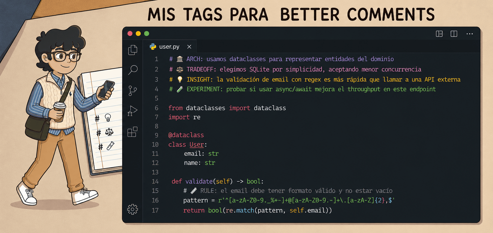
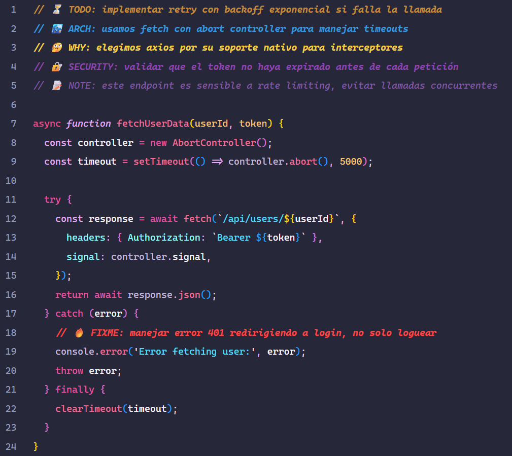
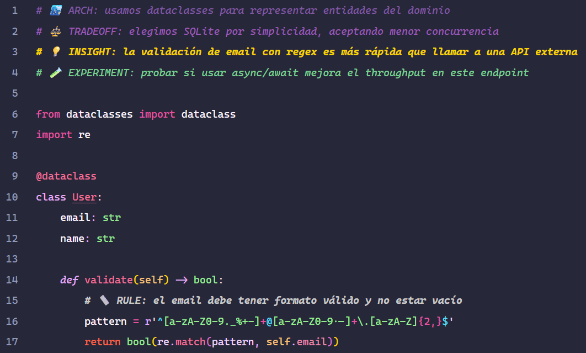
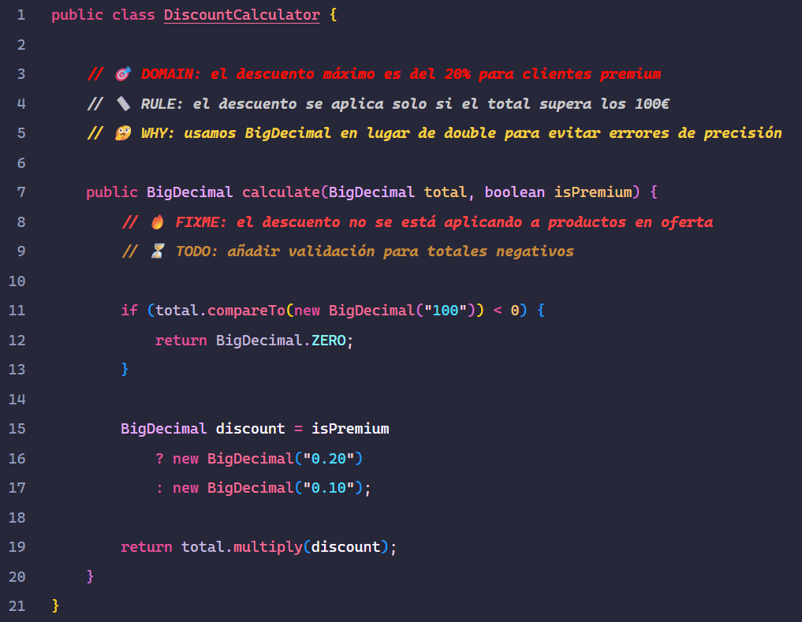
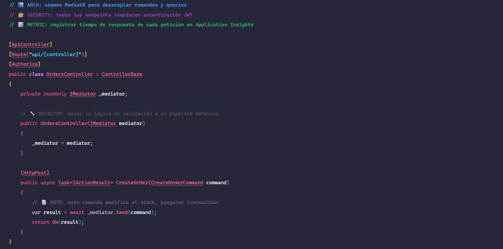
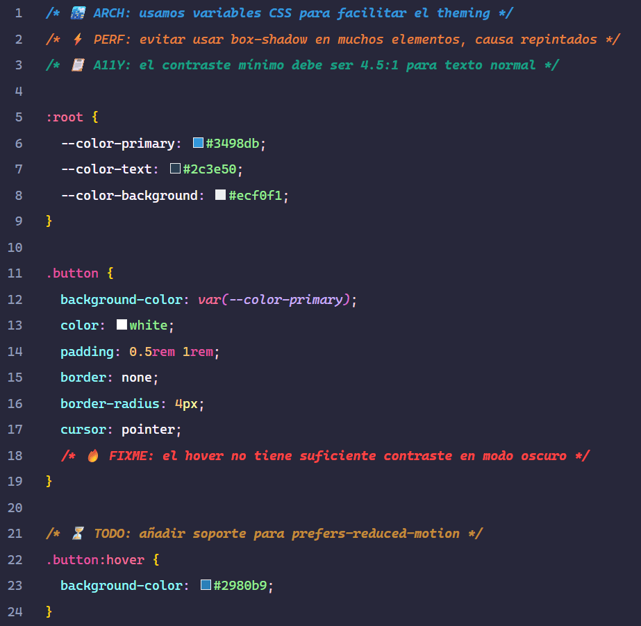
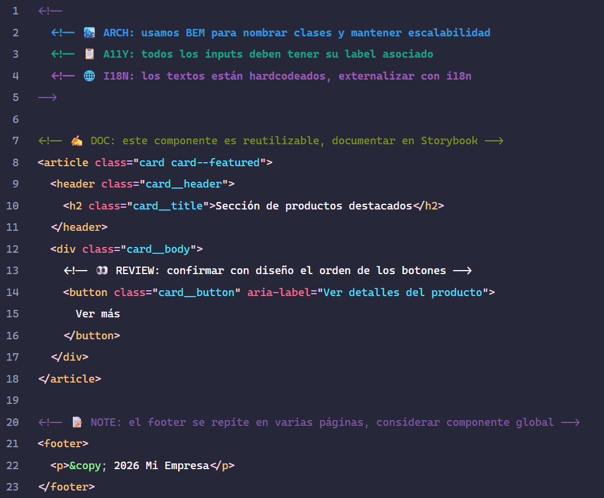

# Better Comments Professional (Emoji Edition)

> Configuración avanzada de Better Comments para VS Code con emojis semánticos, diseñada para equipos que quieren código autodocumentado y un proceso de aprendizaje visible.

   

## 🚀 Instalación rápida

1. **Instala la extensión** [Better Comments](https://marketplace.visualstudio.com/items?itemName=aaron-bond.better-comments) en VS Code.
2. **Copia el contenido** de `.vscode/settings.json` en tu `settings.json` global o de proyecto.
3. **Copia los snippets** de `snippets/better-comments.code-snippets` en tu carpeta de snippets de VS Code (Archivo > Preferencias > Fragmentos de código > Nuevo archivo global).
4. **Reinicia** VS Code.

## 📚 Documentación completa

Consulta la [guía detallada de cada etiqueta](./docs/better-comments-tags.md) para conocer cuándo y cómo usar cada una, con ejemplos y plantillas.

## 🎯 Resumen de etiquetas

| Categoría         | Etiquetas                                                                                                                          |
|-------------------|------------------------------------------------------------------------------------------------------------------------------------|
| **Pendiente**     | `⏳ TODO`, `🎉 DONE`, `🔥 FIXME`                                                                                                    |
| **Arquitectura**  | `🏙️ ARCH`, `⚖️ TRADEOFF`                                                                                                          |
| **Calidad**       | `🔐 SECURITY`, `⚡ PERF`, `⚠️ WARNING`                                                                                              |
| **Negocio**       | `🎯 DOMAIN`, `📏 RULE`, `👀 REVIEW`, `✅ TEST`                                                                                      |
| **Aprendizaje**   | `💭 THINK`, `❔ QUESTION`, `📌 ASSUMPTION`, `🔎 INVESTIGATE`, `🤓 LEARN`, `🤔 WHY`, `🧪 EXPERIMENT`, `🔁 ALTERNATIVE`, `💡 INSIGHT` |
| **Mantenimiento** | `🔧 REFACTOR`, `🗑️ DEPRECATED`, `💾 CHANGELOG`, `🧩 HACK`, `🐛 DEBUG`, `📍 LOG`                                                   |
| **Cumplimiento**  | `📋 A11Y`, `🌐 I18N`, `✍️ DOC`, `📊 METRIC`                                                                                        |
| **Ideas**         | `✨ IDEA`, `📝 NOTE`                                                                                                                |

## 📝 Ejemplos de uso

> Todas las capturas están disponibles en la carpeta [`assets/imgs/`](./assets/imgs).

<h3 align="center">🟨 JavaScript</h3>

---

<h3 align="center">🟦 Python</h3>

---

<h3 align="center">☕ Java</h3>

---

<h3 align="center">🟣 C#</h3>

---

<h3 align="center">🎨 CSS</h3>

---

<h3 align="center">🧱 HTML</h3>

## 🤝 Contribuciones

¿Falta alguna etiqueta que uses a menudo? ¿Encontraste un error? Abre un [issue](https://github.com/MiroDev20/better-comments-professional/issues) o envía un pull request. ¡Toda ayuda es bienvenida!

## 📄 Licencia

MIT © [Miguel Rodríguez](https://github.com/MiroDev20) — Ver [LICENSE](./LICENSE)
